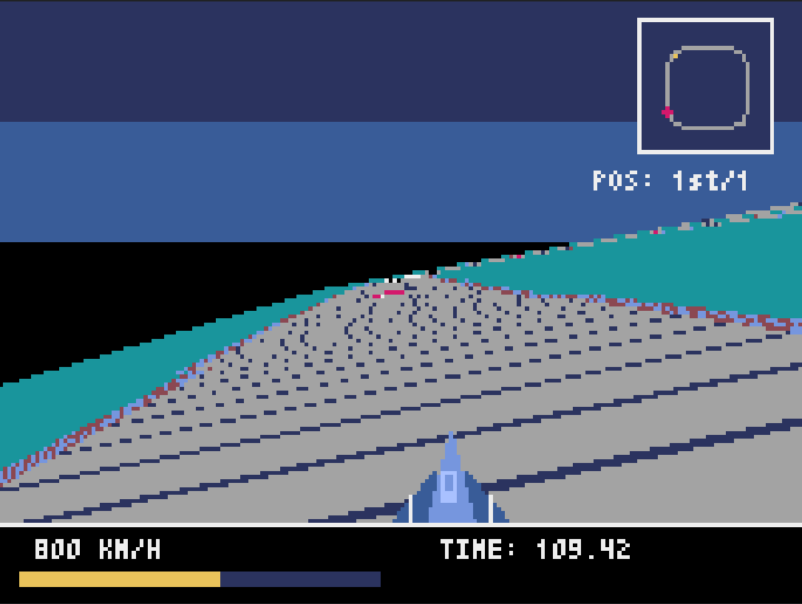

# Pyxel スキル

Pyxel 2.7.8+ に対応した **AI エージェント用開発スキルスイート** と、その成果物として、テスト用のゲームを作りました。

## 🌟 目的
本プロジェクトは、AI エージェントが Pyxel ゲームエンジンを最大限に活用するための「スキル」を定義することを試みました。

## 🎮 動作確認のために試作したゲーム  
動作を確認するためでゲームとしては骨組みだけです。


### 1. Pyxel F-ZERO みたいなゲーム (Racegame)
Mode 7 風の 3D 描画を活用した、疾走感あふれる高速レースゲームです。
Pyxel 2.7.8の新機能を使いました。


*(Mode 7 3D レンダリングとドリフト走行の様子)*

- **特徴**:
    - **Mode 7 3D レンダリング**: `bltm3d` を駆使した奥行きのある擬似 3D コース。
    - **ドリフト物理**: 慣性とグリップ力を分離し、旋回時の「滑り」を再現。
    - **リアルタイムミニマップ**: コースの全貌と自車位置を正確に投影。
    - **本格サウンド**: ベース、メロディ、リズムの 3 チャンネル構成 BGM。
- **操作方法**:
    - `↑`: 加速 / `↓`: ブレーキ・後退
    - `←` `→`: 旋回（高速時はドリフトが発生）
    - `R`: スタート地点へリセット（スタック救済）
    - `ESC`: 終了
- **実行方法**:
    ```bash
    uv run python src/racegame/main.py
    ```

---

### 2. Roguelikeなゲーム
ターン制ローグライクゲームです。

- **特徴**:
    - **視界制限 (Fog of War)**: プレイヤーの周囲数マスしか見えない緊張感。
    - **ネイティブ衝突判定**: `tilemaps[].collide` を用いた正確な移動。
    - **自動生成BGM**: シーンに応じた動的な音楽。
- **実行方法**:
    ```bash
    uv run python src/roguelike/main.py
    ```

## 🌐 Web プレビュー / 書き出し
本プロジェクトは WebAssembly (WASM) への書き出しをサポートしており、`dist/` ディレクトリにビルド済みの HTML が整理されています。

- **レースゲーム (Web版)**: `dist/racegame/index.html` をブラウザで開く。

## 🛠️ Pyxel Development Suite (Agent Skills)
`.agents/skills/Pyxel_dev_suite` に、AI が Pyxel 2.7.8 の最新機能を正しく扱うための知見が格納されています。

1.  **Core**: 2.7.8 以降の数学・乱数関数の活用。
2.  **Audio**: `sounds[]`/`musics[]` 配列アクセスと `gen_bgm` の最新知見。
3.  **Racing**: `bltm3d` 制御、ドリフト物理、ミニマップ投影ロジック。
4.  **Web Export**: 相対インポートを排除した Web (Pyodide) 互換パッケージング。

## 📂 ディレクトリ構成
- `src/racegame/`: レースゲーム・ソースコード
- `src/roguelike/`: ローグライク・ソースコード
- `dist/racegame/`: レースゲーム・Web配布用ビルド
- `.agents/skills/`: AI エージェント用スキル定義

## 📜 ライセンス
MIT Licenseです。ただし、ライブラリは個別のライセンスに従ってください。